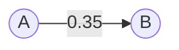
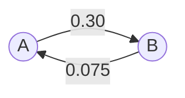
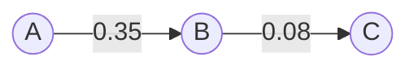
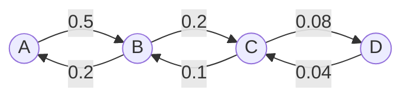
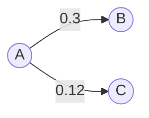
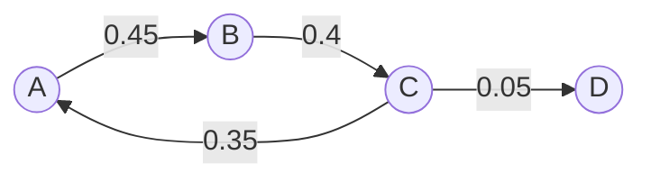

# RxnClock, time to completion

A chemist measures one point on a reaction and wants to know how long it takes to
reach 50%, 90%, or 99% conversion, at that temperature or another. RxnClock answers
that, and it is careful about what it does not know: where the reaction order was
assumed rather than measured, the spread across plausible orders is the headline and
the single number is a detail inside it.

## What it looks like

The mechanism is a node map you build by dragging one species onto another. After a
fit, each arrow carries its own rate constant twice over: stroke width and greyscale
both scale with the constant, so the fast step reads heavy and dark at a glance.


Reversible steps render as two opposing arrows (a chemist's equilibrium, never a
double-headed resonance arrow), with each direction's constant beside its own shaft:


Every example card carries its network as a thumbnail drawn in the same visual
language, so the gallery reads as a family of mechanisms before any text:


On the Estimate page, one measured point plus a model gives the whole curve, with
the candidate orders overlaid and the promised times (50%, 90%, 99%) annotated:


## The example mechanisms

Each example ships with synthetic data generated from stated constants, so every
fit is verifiable against ground truth. The scheme text on the left is the app's
own input syntax; the graph is the network it draws.

**E1, single conversion** (`A -> B`, k = 0.35 h⁻¹):



**E2, reversible pair** (`A = B`, k = 0.30 / 0.075 h⁻¹):



**E3, sequential intermediate** (`A -> B`, `B -> C`):



**E4, four-species reversible chain** (`A = B`, `B = C`, `C = D`, six constants):



**E5, branched pathways** (`A -> B`, `A -> C`):



**E6, complex 2D network** (`A -> B`, `B -> C`, `C -> A`, `C -> D`; a loop with a
leak that no chain can mimic):



Multi-word species from real CSV headers work the same way, quoted:
`"Starting Material" -> "Product 1"`.

## Pages

- **Estimate**: one measured point, a kinetic model, and the time to any conversion,
  with the uncertainty band front and centre.
- **Fit**: paste or upload a time course, draw the mechanism as a node map, and fit
  one rate constant per step. Built for real files: multi-word CSV headers,
  mass-balance columns, catalytic steps, replicates.
- **Learn**: the kinetics behind the two pages.

## Quick start

Requires Node 23 or later (TypeScript runs directly via `--experimental-strip-types`).

```
npm install     # dev dependencies only; the app itself has none
npm start       # builds, then serves on http://localhost:3000
```

| Command | Does |
|---|---|
| `npm test` | Vitest, whole suite, prose guard first |
| `npm run typecheck` | `tsc --noEmit` |
| `npm run coverage` | Vitest with v8 coverage |
| `npm run lint:prose` | punctuation guard on its own |

### Deploying

The app is fully static at runtime: the pages import the compiled engine directly
and no server code runs in production. `npm run build:site` compiles the engine and
copies it to `web/dist/` (a gitignored deploy artifact), so any host that serves
`web/` as its root works. `wrangler.jsonc` configures Cloudflare Workers to do
exactly that: `npx wrangler deploy` builds and publishes.

One per-clone setup step enables the pre-commit guard:

```
git config core.hooksPath .githooks
```

## The Fit page

- **Data in**: comma, tab, or semicolon delimited with RFC 4180 quoting; whitespace
  splitting only for delimiter-free pastes. Multi-word headings such as
  "Starting Material" stay one column. The time unit is inferred from the time
  column's own heading ("time (min)", "t/h"). A detected-columns notice shows
  exactly what the parser saw.
- **Mass balance**: columns recognised by name (mass balance, MB, total, recovery,
  and variants) or by numbers (row-wise sum of the others, or constant near 100)
  are plotted but never fitted, with a per-column override.
- **Mechanism**: drag from one species to another to draw a step; equilibria render
  as two opposing arrows, never a double-headed one. The scheme text is the source
  of truth, with quoted names for headings the bare grammar cannot carry:
  `"Starting Material" -> "Product 1"`. Catalytic steps are written naturally,
  `S + Cat -> P + Cat`, and fitted as pseudo-first-order.
- **Results**: each arrow's width and greyscale both follow its own constant, so the
  fast step reads heavy and dark at a glance. Constants carry units derived from
  each step's molecularity; catalytic steps report k_obs and, once concentrations
  are entered, the true k = k_obs/[Cat]. R squared, SSE, and RMSE beside them.
- **Export**: the plot as SVG and 3x PNG, the data as a sectioned CSV (raw points,
  fitted curves, constants with units, mechanism and date in the header), or both
  in a zip, all generated without a single runtime dependency.

## Architecture rules

These are enforced, not aspirational; see `CLAUDE.md` for the full statement.

- **The registry is the only place chemistry lives.** One file per kinetic model
  under `src/models/`; nothing in the solver, explanation, or API layers may branch
  on a model's identity. A build-failing test checks this.
- **Zero runtime dependencies.** `package.json` has an empty `dependencies` block
  and a test asserts it stays empty.
- **No non-finite number reaches the UI.** Unreachable targets carry a sentinel and
  render as "never"; nothing displays NaN or Infinity.
- **Units**: Kelvin, seconds, mol/L internally; conversion only at the UI boundary.
  A rate constant's units depend on the order, so no unit string is hardcoded.

## Layout

```
src/        TypeScript engine: models, solver, numerics, lib (network fitter, CSV,
            mass balance, export), api, http server
web/        the three pages, vanilla ES modules, no framework
tests/      13 vitest suites, 407 tests, including architecture guards
docs/       design notes
verification/  browser-driven verification rounds, screenshots, defect logs
scripts/    the prose guard
```

[About the author](https://wenlaihan.github.io/).
